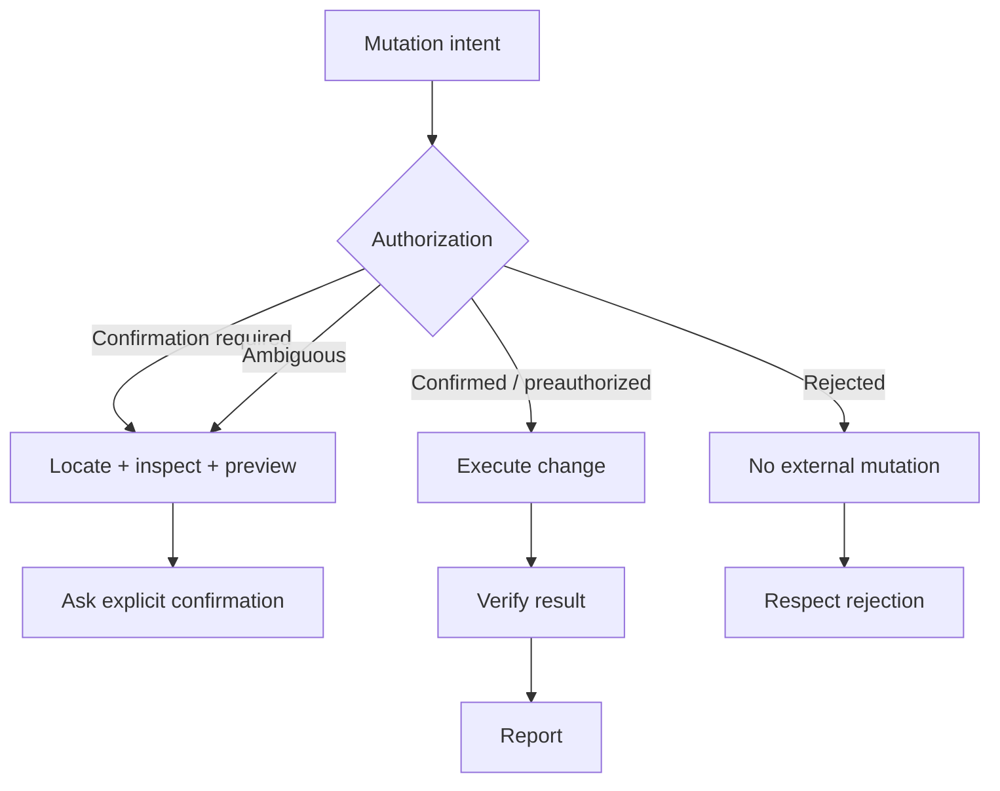

# Docs/Drive Agent RL 核心设计

本页专门回答“完整系统中哪些部分是本人设计的、为什么这样设计、解决了什么问题”。系统流程见[完整项目说明](project.md)。

## 1. 设计总览

| 设计 | 核心问题 | 方案 |
|---|---|---|
| 外部 Agent 与本地 Policy 的 Relay | 真实环境执行与训练框架彼此不可见 | 在模型请求边界转发并采集精确 Token/Logprob |
| 账号世界与两级并发 | Seed 成本高，环境容量与 GPU 容量不同 | Group 复用账号世界，账号并发与 Relay 并发解耦 |
| Outcome-first 状态图 | 工具调用不等于任务完成 | 状态 DAG + Checklist Judge + 确定性证据 |
| Authorization-aware Verifier | 写操作存在授权与副作用 | 验证前按授权状态物化不同任务图 |
| Boundary-only Advantage | 终局奖励稀疏，Segment 回填会误奖 | 只在状态首次完成的 Turn 注入局部信号 |
| Skill/Verifier 分离与演化 | 固定 Reward 难覆盖长尾任务 | 策略与验证契约分离，离线提案、回放和门禁 |
| 可审计训练闭环 | 外部失败与算法失败容易混淆 | 标量监控、版本固定、Live 多轮评测和失败回流 |

## 2. 外部 Agent—本地 Policy Relay

### 问题

真实 Agent Runtime 掌握工具协议、账号状态与多 Agent 编排；VERL/vLLM 掌握 Policy 参数和训练所需 Logprob。若直接调用外部模型 API，只能拿到文本结果，无法进行严格的 On-policy 更新；若重写 Agent，又会改变真实执行语义。

### 设计

在 Agent 的模型调用边界插入 Relay：

```text
Agent model request
  → attach correlation id
  → Relay lane
  → local vLLM OpenAI-compatible endpoint
  → completion + exact logprobs
  → Relay trace store
  → original Agent execution
```

每条 Rollout 使用独立 Correlation ID。Relay 不理解 Docs/Drive 任务语义，只负责：

- 转发请求。
- 捕获 Prompt/Completion Token IDs 与 Logprobs。
- 记录请求边界和受控错误摘要。
- 在多并发下将 Trace 准确归属于原始 Rollout。

### 价值

- 保留真实 Agent、工具和环境行为。
- Policy 请求实际由待训练模型生成。
- 每个模型调用都能还原为训练样本。
- Runtime 与 Reward 可以独立演进。

### 设计边界

Relay 的端到端延迟包含排队与完整 Decode，不等价于精确 TTFT；这一点在监控中明确区分。

## 3. 账号世界复用与并发解耦

### 问题

每条 Rollout 单独清理、Seed 和创建账号世界，会把大量时间花在环境准备；但让所有 Rollout 无约束共享账号，又会产生状态污染。与此同时，账号环境的容量与本地 vLLM 的吞吐不是同一个资源维度。

### 设计

以一个 Query 的 Rollout Group 为环境生命周期单位：

```text
group id
  → acquire one account
  → cleanup + seed once
  → mark group ready
  → launch N rollout members
  → cleanup temporary task state
  → release account
```

容量拆分为：

- **Account concurrency：** 同时存在多少个已准备好的账号世界。
- **Group member concurrency：** 同一 Case 同时采样多少条策略轨迹。
- **Relay concurrency：** 同时压到本地模型服务的请求数。

### 价值

- Seed 成本在 Group 内分摊。
- 同组采样拥有一致初始数据。
- GPU 推理压力可以独立限流。
- 账号等待、Agent/Tool 延迟和模型延迟可以分别诊断。

### 设计边界

Group Ready 只保证相同初始状态，不保证并行期间状态不可变。写工具、评论、分享和记忆操作仍可能相互影响，因此 Reward 与实验分析不能把共享世界误认为只读快照。

## 4. Outcome-first 状态 Verifier

### 问题

用固定工具序列作为 Process Reward 会产生 Reward Hacking：

- 调用了读取工具，但读取了错误文档。
- 调用了编辑工具，但范围或内容错误。
- 工具返回失败，模型仍获得调用奖励。
- 使用不同但正确的工具路径反而得不到奖励。
- 未经授权执行写操作可能被误判为“进度”。

### 设计

状态节点描述用户可验证的任务事实，而不是动作名称。例如：

```text
resolve target document
  → establish authoritative content
  → determine requested edit scope
  → obtain required confirmation
  → apply confirmed edit
  → verify resulting content
  → report completion
```

一个状态的关闭由四层共同决定：

1. **Semantic Checklist：** 说明该状态需要满足的语义条件。
2. **LLM Judge：** 基于当前 Case 约束和逐 Turn 证据判断 PASS/FAIL/NA。
3. **Deterministic Gate：** 检查必要工具结果、失败响应、Turn 范围等可程序化事实。
4. **DAG Dependency：** 前置状态未完成时，后续状态不能独立关闭。

工具名仅用于定位候选证据，不能直接完成状态。

### 价值

- Reward 与具体执行路径解耦。
- 可以奖励不同但语义正确的策略。
- 能明确解释某个 Turn 为什么获得局部信号。
- Verifier 可以独立测试、版本化和回放。

### Fail-closed

以下情况不会静默发奖励：

- Judge 不可用或超时。
- 结构化输出不合法。
- Checklist 缺失。
- Judge PASS 与确定性证据冲突。
- DAG、Turn Index 或 State ID 不一致。

## 5. Authorization-aware 状态图

### 问题

Docs/Drive 中相同的编辑或分享动作，在不同对话上下文下可能有完全不同的正确行为：

- 用户仅表达修改意图，尚未确认具体预览。
- 用户已经明确确认。
- 运行时提供可信的预授权。
- 用户拒绝或撤回。
- 上下文含糊，无法确认授权范围。

如果所有 Case 共用“执行并验证”的固定状态图，模型会被鼓励过早产生外部副作用。

### 设计

先从可信对话历史与运行时标记推断授权状态，再物化当前轨迹应使用的状态分支：



自动识别“已确认”必须存在先前 Assistant 的明确确认请求和后续 User 的明确同意；预授权只接受可信运行时字段，不能从普通注入文本推断。

### 价值

- 将安全策略纳入 Reward Contract。
- 区分“正确地请求确认”和“拖延执行”。
- 对未经确认的成功写调用进行全局 Veto。
- 保留读取、定位和预览等合法前置进度。

## 6. Boundary-only Segment Advantage

### 6.1 从审计出发

多轮轨迹展开为多个 Model-call Row 后，简单把终局分数或衰减 Process Reward广播到 Segment，会产生两个问题：

- 非完成 Turn 获得本不属于它的正向局部信号。
- 不同长度轨迹在 Row 级 Group Baseline 中权重不同。

Docs 历史轨迹审计覆盖 400 条轨迹、1,931 个 Turn Row，其中 79.3% 是非终局 Row；49/50 个 Query Group 的 Row-weighted Baseline 与每轨迹等权 Baseline 不同。

### 6.2 当前方案

当前版本没有把局部 Reward 向前反向传播，而是只标记首次完成边界：

```text
boundary(t, m) = 1
  iff milestone m becomes valid for the first time at turn t
```

组内局部 Advantage：

```text
p(q, m) = mean_j completed(j, m)
A_local(j, t) = 1 - p(q, m), at the completion boundary
                0, otherwise
```

总 Advantage：

```text
A_total(j, t) =
    A_global(j, t)
    + lambda × boundary(j, t) × A_local(j, t)
```

### 6.3 为什么不给未完成轨迹负局部分

未完成某个状态可能有多种原因：

- 策略错误。
- 上游工具失败。
- 环境不适用。
- 轨迹在更早位置已经进入另一条合法路径。
- Verifier 证据不足。

直接给所有未完成轨迹负局部分，会把 Verifier 不确定性放大成策略惩罚。因此当前设计只奖励组内有区分度的完成边界，失败仍由全局 Outcome Advantage 处理。

### 6.4 兼容性约束

`local_weight=0` 时，Advantages 与 Returns 必须逐元素等于基线 GRPO。该性质由自动化测试覆盖，使 Process Reward 可以作为可关闭的增量模块接入。

### 6.5 已知限制

- 当前版本不对失败轨迹提供“正确前缀保护”。
- 全局 Outcome Advantage 仍可能广播到全部 Model-call Row。
- 当前设计修正的是局部 Milestone 信号的错误回填，并不宣称已经解决所有长程信用分配问题。

## 7. Skill 与 Verifier 的分离

### 问题

把策略建议、状态定义和 Judge Prompt 写在一个不可变 Reward 函数中，会导致：

- 新任务只能改代码。
- Judge 语义变化难以追踪。
- 训练中的 Reward Contract 可能漂移。
- 成功经验与验证标准相互污染。

### 设计

每个 Task Family 保存两个相互关联但职责不同的对象：

```text
Skill:
  reusable strategy and failure lessons

Verifier:
  state template
  semantic checklist
  deterministic evidence
  hard failures
  dependency DAG
```

Case 实例化时再绑定具体文件、目标范围、输出格式、分享对象和授权条件。

### 演化流程

```text
historical disagreement
  → proposal examples
  → candidate family templates
  → held-out checklist judging
  → precision/recall/cofire metrics
  → acceptance gate
  → versioned publication
```

同一 Case 的 8 条 Rollout 始终处于同一 Split，避免轨迹级随机切分造成泄漏。未通过完整 Dev 与 Sealed Test 的候选不会覆盖线上训练版本。

## 8. 可观测与证据分层

### 问题

真实环境训练的一个慢 Step 可能来自账号排队、Seed、Agent Router、Docs/Drive Tool、Relay、vLLM、Judge 或 Backward。只记录总耗时无法定位。

### 设计

按生产者记录统一标量事件：

- Rollout Worker：账号等待、环境准备、Agent 执行和轨迹抽取。
- Relay：请求并发、总延迟、Token 吞吐与错误。
- Trainer：Reward、Advantage、Loss、KL、梯度和 GPU。
- Verifier：状态覆盖、Judge 尝试、结构化错误和耗时。
- Evaluator：Checkpoint、Case 数、各维通过率和 Judge Error。

监控事件主动排除 Prompt、账号、鉴权头、Token ID、工具参数和模型响应，调试轨迹与运营指标分开保存。

### 证据分层

公开结论按以下强度书写：

1. **实现证据：** 代码、配置和测试说明系统具备某项能力。
2. **离线回放：** 保存轨迹上的映射、覆盖和 Verifier 结果。
3. **Live 评测：** Checkpoint 在真实 Agent 环境中的多轮聚合结果。
4. **因果提升：** 需要同配置对照和独立测试；当前 Milestone 方案尚未达到这一证据等级。

## 9. 设计原则总结

整套设计贯穿以下原则：

- **真实环境优先：** 不用静态 Mock 代替最终工具执行。
- **结果优先：** Reward 判断任务事实，不奖励固定工具路径。
- **证据约束：** LLM Judge 不能越过确定性失败和 DAG 依赖。
- **安全内生：** 授权状态是任务图的一部分，而不是事后过滤。
- **局部最小化：** Process Reward 只作用于最有证据的完成边界。
- **版本固定：** 一次训练 Run 使用不变的 Reward/Verifier Contract。
- **可回放：** 新规则先在历史轨迹上验证，再进入训练。
- **结论克制：** 系统打通、离线准确和最终效果提升分别报告。
