# Docs/Drive Agent RL 完整项目说明

## 1. 项目定位

这是一个面向 Google Docs 与 Google Drive 真实工具环境的 Agent RL 后训练系统。它不是在静态文本环境里对单轮答案打分，而是让 Policy Model 进入真实 Agent 执行链路，读取账号中的文档和文件、规划多轮动作、调用工具，并依据最终任务结果与中间状态更新策略。

本人负责的主线是完整 RL 体系搭建：

- 将 Docs/Drive benchmark、账号 Seed 和任务元数据转换成统一训练契约。
- 将真实 Agent 执行框架接入本地 Policy Model，形成可并行的在线 Rollout。
- 回收每次模型调用的精确 Token ID 与 Logprob，转换成 VERL 可训练轨迹。
- 接入任务级 Outcome Reward，并实现状态化 Process Reward。
- 基于 GRPO 完成多卡训练、Checkpoint、恢复和评测。
- 建立训练监控、Live 环境复测和失败轨迹回流。

在系统基础上，本人进一步设计了四项核心机制：

1. **真实环境轨迹桥接：** 外部 Agent 继续负责工具编排，本地 vLLM 负责 Policy 推理，通过 Relay 回收训练所需的原始概率轨迹。
2. **任务状态 Verifier：** 用状态 DAG、语义 Checklist、确定性工具证据和依赖关系共同判断任务进度。
3. **Boundary-only 信用分配：** 局部训练信号只落在状态首次完成的模型调用边界。
4. **Skill/Verifier 演化：** 从历史成功与失败轨迹提炼类别级策略和状态模板，经离线回放与门禁后版本化发布。

## 2. 为什么需要完整 RL 体系

Docs/Drive Agent 的难点不只是生成自然语言，而是完成一个有环境状态、有权限约束、有外部副作用的长链路任务。

| 问题 | 对 RL 系统的要求 |
|---|---|
| 一次任务包含多轮模型调用和工具返回 | 必须保留每轮可见上下文、动作 Token 和行为概率 |
| Agent 执行在外部服务中，本地训练框架看不到内部轨迹 | 需要在模型请求边界建立可追踪的 Relay |
| 不同 Rollout 需要一致的初始文件与权限世界 | 需要账号清理、Seed 注入、租约和生命周期管理 |
| 终局成功率低且奖励稀疏 | 需要可验证的中间任务状态，但不能奖励固定工具序列 |
| 创建、编辑、移动、分享会改变外部状态 | Reward 必须理解用户授权，而不是鼓励盲目执行 |
| 外部工具、网络和 Judge 都可能失败 | 需要分层重试、Fail-closed、监控和恢复 |
| 多轮轨迹展开后长度不同 | 需要正确的 Padding、Mask 和组内 Advantage 口径 |

## 3. 端到端架构

```mermaid
flowchart LR
    A[Docs/Drive Cases] --> B[Dataset Contract]
    B --> C[Ray GRPO Trainer]
    C --> D[AgentLoop Manager]
    D --> E[Account World Pool]
    D --> F[Rollout Workers]
    F --> G[Real Agent Runtime]
    G --> H[Docs/Drive Tools]
    G --> I[Relay Bridge]
    I --> J[Local vLLM Policy]
    J --> I
    I --> K[Prompt/Token/Logprob Trace]
    K --> L[Multi-turn Training Rows]
    L --> M[Outcome Reward]
    L --> N[Milestone Verifier]
    M --> O[Global GRPO Advantage]
    N --> P[Boundary Local Advantage]
    O --> Q[Policy Update]
    P --> Q
    Q --> R[Checkpoint Evaluation]
    R --> S[Failure Analysis]
    S --> T[Skill/Verifier Evolution]
    T --> N
```



系统边界遵循三个解耦原则：

- **训练算法与环境解耦：** VERL 负责 GRPO 更新，AgentLoop 负责进入真实环境。
- **Rollout 与任务语义解耦：** Relay 只采集策略轨迹，具体任务如何打分由 Reward Plugin 决定。
- **策略与 Verifier 解耦：** Skill 文本用于描述任务策略，状态图用于判断可奖励进度，两者独立版本化。

## 4. 数据与任务层

### 4.1 训练任务

当前公开总结对应两个单轮 benchmark：

| Domain | Case 数 | 每组采样 | 主要任务 |
|---|---:|---:|---|
| Docs | 50 | 8 Rollouts / Case | 文档读取、新建、导出、编辑、替换、评论及边界任务 |
| Drive | 85 | 8 Rollouts / Case | 文件检索、聚合、移动、复制、分享及边界任务 |

“单轮 benchmark”表示用户请求是单轮入口，不表示 Agent 只调用一次模型。实际执行通常包含多次推理、工具调用和结果观察。

### 4.2 Dataset Contract

每条训练样本同时包含：

- 用户 Prompt 与数据来源。
- Task ID、Domain、任务族和 Ground Truth。
- 账号环境、Seed 资源和时间等运行元数据。
- 任务级 Reward 配置。
- 用于轨迹关联、重试和评测的稳定 ID。

数据脚本只负责产出统一契约；Rollout Runtime 不写死 Docs/Drive 的业务打分规则，因此新任务可以通过新增数据构造器和 Reward Plugin 接入。

### 4.3 环境可复现

每个 Rollout Group 在开始前建立账号世界：

1. 租用一个可用账号。
2. 清理上一任务遗留的文件、设置或临时状态。
3. 注入当前 Case 的 Seed 数据。
4. 标记 Group Ready。
5. 同一 Case 的多个 Rollout 从一致初始世界出发。
6. Group 完成后集中清理并释放账号。

共享账号世界减少了重复 Seed 成本，但环境并非只读快照。并行 Rollout 可能产生写入，因此系统显式记录这一一致性边界，并把账号并发与模型请求并发分开控制。

## 5. 真实环境 Rollout

### 5.1 执行链路

单条轨迹的核心过程是：

```text
acquire account
  → cleanup and inject seed
  → run Agent in Docs/Drive environment
  → Agent sends model request
  → Relay forwards request to local Policy
  → Policy returns completion and logprobs
  → Agent observes result and calls tools
  → repeat until final response
  → collect trace and release account
```

真实 Agent 与工具服务保持原有执行语义；训练系统不模拟工具结果，也不要求 Agent 改成 VERL 内置的单轮生成接口。

### 5.2 Relay Bridge

Relay Bridge 解决“外部 Agent 执行、内部 Policy 训练”之间的断点：

- 为每条 Rollout 分配 Correlation ID，隔离并发请求。
- 将 Agent 发出的模型请求转发到训练侧本地 vLLM。
- 保留每次调用的 Prompt IDs、Completion IDs 和 Token Logprobs。
- 对上游响应、超时和错误做有界摘要，避免日志泄露完整内容。
- 将 Relay 并发独立于账号池容量，便于分别定位环境瓶颈和推理瓶颈。

这一步使真实工具执行轨迹满足 On-policy 更新所需的数据条件，而不需要修改外部 Agent 的规划和工具协议。

### 5.3 多轮轨迹转换

一次 Agent 任务可能产生多个模型调用。系统不会只训练最终回答，而是：

1. 按模型调用边界恢复每轮 Prompt、Response 和 Logprob。
2. 检查相邻调用之间的前缀兼容关系。
3. 将每个 Policy Model Call 展开成独立训练 Row。
4. 保留同一原始任务的 UID、Turn Index 和终局 Outcome。
5. 对不同长度的展开 Batch 做 Data Parallel Padding。
6. 使用有效样本 Mask，确保 Padding Row 不进入 Reward、Advantage 和 Loss。

验证阶段保留一条 Case 对应一个输出的评测口径；训练阶段则展开全部模型调用。

## 6. Reward 与 Verifier

### 6.1 Outcome Reward

终局 Reward 由 Docs/Drive benchmark Judge 对最终执行结果评分。它回答的是“整个任务是否完成”，是全局 GRPO 信号的来源。

Reward 通过插件接口接入，因此：

- Runtime 不依赖具体 Judge。
- Docs 与 Drive 可以共享训练主链路。
- Judge 模型、Prompt 版本和错误策略可以单独固定。
- Judge 初始化或结构化输出失败时可以 Fail-closed，避免把缺失分数当成有效奖励。

### 6.2 Milestone Process Reward

仅靠终局分数难以判断长任务中哪一步真正推进了任务。本人设计的 Milestone Verifier 以“任务状态是否达成”为中心：

```text
实例化状态图
  + 当前轨迹的真实工具结果
  + 每个状态的语义 Checklist
  + Hard Failures
  + DAG 依赖
  + Authorization Context
  → PASS / FAIL / NOT_APPLICABLE
  → earliest completion turn
```

工具调用名称只是候选证据。例如“调用了文档更新工具”不能直接证明编辑内容、目标文档、范围和授权都正确。状态完成必须同时满足语义 Judge、确定性证据门控和依赖约束。

### 6.3 授权感知

对于创建、编辑、评论、移动、分享等外部变更，系统在验证前根据轨迹物化授权分支：

| 授权状态 | 可奖励行为 |
|---|---|
| confirmation required | 定位对象、读取现状、给出具体预览并请求确认 |
| confirmed / preauthorized | 执行变更、验证结果并报告 |
| ambiguous | 按未确认处理 |
| rejected | 尊重拒绝并验证没有发生外部变更 |

这避免了两个相反错误：未确认便执行写操作获得奖励，以及用户已经明确授权后仍被错误要求重复确认。

## 7. Advantage 与策略更新

### 7.1 全局信号

同一 Query 的多个 Rollout 形成 GRPO Group。终局 Outcome Reward 计算全局 Advantage，并按基线实现作用于轨迹中的 Policy Call。

### 7.2 局部信号

状态在 Turn `t` 首次完成时，该 Turn 才产生 Boundary：

```text
r_process(t) = 1, if one or more milestones first complete at t
               0, otherwise
```

对同一 Query、同一 Milestone 进度，使用组内完成率作为 Baseline：

```text
baseline(q, m) = mean(completed(rollout, m))

A_local(j, t) = 1 - baseline(q, m), at first-completion boundary
                0, otherwise
```

最终 Advantage：

```text
A_total = A_global + boundary_mask × local_weight × A_local
```

关键性质：

- 不向状态完成之前的 Turn 反向衰减或回填局部奖励。
- 未完成该状态的 Rollout 不接收额外负局部 Advantage。
- 同一 Turn 完成多个状态只产生一次 Boundary Reward。
- 全组都完成同一状态时局部 Advantage 为 0，不重复强化无区分度行为。
- `local_weight=0` 时严格退化为原始 GRPO Advantage。

当前版本有意保留全局 Outcome Advantage 的基线行为；失败轨迹中的负全局信号仍可能作用于前缀。该限制与后续改进方向在[实验与结果](evaluation.md)中单独记录。

## 8. SkillBank 合成与演化

### 8.1 离线合成

SkillBank 从保存的 Docs/Drive Reward-backed Rollout 构建：

1. 关联 Rollout 与 Reward，去除无评分重试。
2. 按 Domain、Operation、Outcome、Cardinality 和 Complexity 做规则分类。
3. 对 Benchmark PASS 再检查核心工具结果和最终回复，保留独立验真的成功轨迹。
4. 合并直接工具调用和沙箱执行链，去除路由、搜索和平台噪声。
5. 从成功与失败轨迹生成脱敏 Experience Cards。
6. 由模型生成类别级策略和语义验收标准。
7. 由代码维护稳定 State ID、依赖 DAG 和确定性 Checklist。
8. 将类别模板绑定到每个 Case 的具体 Query、Seed 资源和约束。
9. 对每个 Case 的 8 条历史 Rollout 完整回放。

策略与 Verifier 分开保存：策略描述“通常应该怎样做”，Verifier 定义“什么事实足以证明状态完成”。训练时固定 Verifier Version，避免同一 Run 中 Reward Contract 漂移。

### 8.2 离线演化

Verifier Evolution 采用 Case 级稳定切分，同一 Case 的多个 Rollout 不跨 Split：

- Proposal：根据错误样本生成候选状态模板。
- Dev：验证 Precision、Recall、Terminal Recall 和依赖共触发。
- Sealed Test：只有同一候选先通过完整 Dev Gate 后才允许评估。

候选发布门槛包括：

- Micro Precision / Recall 均不低于 90%。
- Family Precision / Recall 均不低于 85%。
- Terminal Recall 不低于 90%。
- 依赖状态同 Turn 错误共触发率不高于 5%。

未通过门禁的候选只作为下一轮反馈，不覆盖训练中的 SkillBank。

## 9. 分布式训练与工程能力

训练层基于 VERL、Ray、PyTorch 与 vLLM，支持：

- Qwen 4B 级模型的 Full Fine-tuning 与 LoRA。
- FSDP、Tensor Parallel / Sequence Parallel 和多 GPU 执行。
- Actor 参数、梯度、优化器和激活的显存调度。
- 长上下文动态 Batch 与每 GPU Token Budget。
- Checkpoint 保存、恢复、合并和曲线评测。
- Reward Judge 缓存、并发、重试和结构化输出校验。
- 外部环境长耗时情况下的分层 Timeout 与单样本隔离重试。

系统的并发不是单一数字，而是至少包含三个容量面：

1. 同时活跃的账号世界。
2. 同一世界中的 Group Member。
3. Relay 到本地模型服务的请求并发。

将三者解耦后，可以根据账号等待、工具延迟、Relay 排队和 vLLM 吞吐分别调优。

## 10. 可观测、评测与回流

系统记录不含原始 Prompt、账号标识、Token ID、工具参数和模型回复的标量事件流，包括：

- 训练 Reward、Entropy、Policy Loss、KL、Gradient Norm 和 Learning Rate。
- 账号等待、Seed、Agent 执行、Relay 等阶段耗时。
- Relay 活跃并发、延迟、输出 Token 吞吐和错误类型。
- GPU 显存、利用率与训练阶段。
- Milestone 覆盖率、Judge 耗时、调用次数和失败原因。
- Checkpoint 的 Live 环境评测聚合结果。

评测采用真实 Agent 与 Live 工具环境，对同一 Checkpoint 运行多轮完整 Case 集，并保留均值、样本标准差、Judge Error 和逐维通过率。失败样本进入轨迹审计与 Skill Evolution，形成闭环：

```text
train → checkpoint → live evaluation → failure attribution
      → verifier/data update → next training run
```

## 11. 已完成规模与结果概览

- Docs 50 个 Case、Drive 85 个 Case，每个 Case 保存 8 条 Reward-backed Rollout，共 1,080 条。
- 一次联合回放覆盖 4,127 个 Policy Turn，识别 2,086 个状态完成 Segment。
- 状态相关工具映射率：Docs 93.15%，Drive 91.67%，Verifier 异常为 0。
- Docs 多轮信用审计覆盖 50 个 Query Group、400 条轨迹和 1,931 个 Turn Row。
- 已归档的 Full-training Checkpoint 在三轮 Live 评测中的 Overall Pass：Docs 51.33%，Drive 50.98%，Judge Error 为 0。

这些数字分别证明数据回放、轨迹映射、系统执行和评测链路已经打通；它们不自动证明新的 Milestone Advantage 已提升最终任务效果。完整比较见[实验与结果](evaluation.md)。

## 12. 项目价值

这个项目解决的不是某个 Reward 函数或启动脚本，而是把真实工具型 Agent 变成一个可以持续训练、验证和迭代的 RL 系统：

- 环境侧能够复现任务世界并承载真实副作用。
- 推理侧能够采集 On-policy 多轮行为概率。
- 奖励侧能够区分终局结果、中间进度与安全授权。
- 算法侧能够将稀疏结果信号与边界局部信号组合。
- 工程侧能够并发执行、失败恢复、监控和复测。
- 数据侧能够从历史轨迹中持续演化策略与 Verifier。
