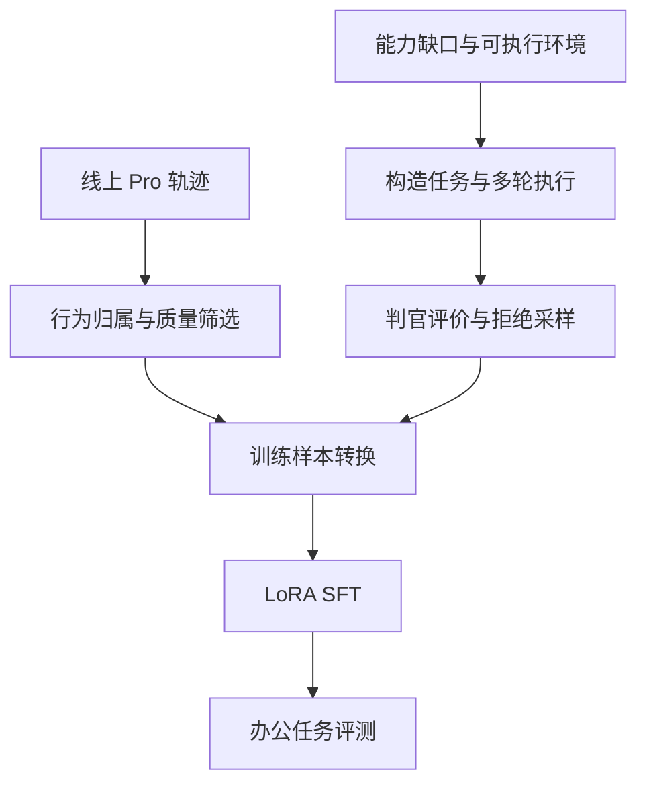

# Pro 数据流水线

## 两种数据来源

Pro 的训练数据建设包含真实轨迹清洗和目标能力缺口合成。两条路径最终都需要检查轨迹是否适合训练。

这是项目逻辑流程；不表示所有步骤属于一个自动运行的线上服务。

## 1. 线上轨迹分析与清洗

### 明确统计与训练的数据单位

- **Trace／请求：** 一次用户消息及对应执行。
- **Session／会话：** 多次相关请求的集合。
- **工具调用：** 一条请求可以有多个调用。
- **训练样本：** 由选定执行单元及上下文转换而来，不一定与上述数量一一相等。

原始 TOOL span 不全是主模型动作。需要沿父节点归属到发起 Agent，并区分代理工具内部名称、router 转交和平台执行过程。

### 检查轨迹是否完整、是否具备可用输入

Pro 流程记录涉及以下清洗问题：

- 无有效训练目标、空输出、执行报错或流式输出只保存片段。
- System 或工具定义缺失。
- 最终答复格式不符合当时产品协议，或已经进入最终答复后继续调用工具。
- 工具调用后轨迹中断，无法确认该任务阶段的输出。
- 历史与当前请求混淆。
- 缺失所依赖的附件内容。

不同任务阶段需要不同判断。零工具调用不等于低质量：它可能是合理确认、追问或直接答复。明确需要确认的请求也不能仅因为没有执行动作就全部删除。

## 2. 根据能力缺口合成任务

### 从覆盖分析形成任务设计

[Pro 流程原始记录](../source-materials/notion/pro-flow.md)中的五天筛选候选统计为 143,360 条，其中 7,957 条命中指定 27 个工具，约 5.55%。目标操作覆盖不足时，需要补充明确的动作情境，例如：

- 文档精确修改、评论或写入。
- 演示文稿增删页、改备注等操作。
- 文件分享与权限相关任务。
- 多轮确认后的继续执行。

这些是特定候选集下的能力缺口；不可扩大为全部线上流量的行为结论。

### 复用可执行环境，改写目标任务

Pro 方法记录描述了复用已检查的环境，针对缺口动作构造 query，再交给 Agent 执行的路径。这样可以复用对象和环境基础，同时改变待学习的操作。

环境必须真实支持所要求的行为。例如，文件分享的收件人不能仅是一个看起来合法、实际上无法被测试环境接受的地址。否则失败来自环境，难以提供正确的模型监督信号。

原始记录点名的 `gen_gap_queries.py` 未在上传的两个代码快照中找到。因此该环节的流程依据是项目记录，不能声称本次逐行审查了这一脚本。

## 3. 授权情境的设计

| 情境 | 正确行为 |
|---|---|
| 用户明确指定文件、收件人及权限，并授权分享 | 在对象核验完成后执行 |
| 用户只讨论“要不要公开”，没有授权具体操作 | 先确认，不能直接公开 |
| 对象存在歧义 | 先消除歧义 |
| 操作失败或目标不可访问 | 如实说明，并按任务需要处理 |

关键是授权的具体范围、对象确定性和操作风险。不能简单等同于“所有写操作都要确认”，也不能把所有写操作都定义为不可逆。

上述表格是面试解释用的抽象情境，不代表已经完成严格的配对因果实验。

## 4. 执行与拒绝采样

1. 固定任务、环境、执行模型和思考档位。
2. 让 Agent 完成多轮执行，保留轨迹和工具结果。
3. 检查工具格式、对象、执行完整性及交付要求。
4. 通过判官评价任务完成情况，收集满足要求的轨迹。
5. 对剩余失败进行分类，决定是否补采或修正任务。

Pro 记录中的三轮通过率为 55.3%→30.2%→22.5%，说明补采边际收益下降。不能把这个过程自动解释为完整的强化学习训练。

### 成功轨迹的局限

最终 PASS 可能包含冗余调用、错误后恢复或偶然成功。训练筛选仍需要关心中间动作是否值得学习。多次判定也不等于多个独立判官对同一条轨迹一致认可。

## 5. 转成 SFT 数据

至少保留：

- 当前任务可见的 system、工具 schema、历史和用户输入。
- 当前任务中被选中的 assistant 输出。
- 工具调用与对应工具返回的关系。
- 监督标记、来源轨迹及可用的模型／运行信息。

历史召回与初始化应答属于输入。工具返回提供下一步决策依据，不直接作为模型生成目标。详见[LoRA SFT](lora-sft.md)。

## 6. 训练与推理环境对齐

Pro 记录提到不同账号或灰度环境可能返回不同工具形态，例如 tool_search 与旧 load_google_tools 链路。训练前需要核对工具 schema 和执行路径，不能只把函数名称相似的数据混在一起。

文件身份、权限、工具定义和上下文压缩都会影响动作是否正确。数据质量检查应覆盖这些依赖，而非只检查最终回复文本。

## 7. v7 基础数据产物

训练服务器下载的[v7 转换元信息](../source-materials/artifacts/pro-v7/README.md)将最终训练输入规模补齐：

| 环节 | 数量／结果 |
|---|---:|
| 读入上游 `v2.jsonl.gz` | 1,149 条 |
| 超过 98,304 token 丢弃 | 15 条 |
| 最终保留 | 1,134 条 |
| Train／Val | 1,102／32 条 |
| Train／Val 任务组交集 | 0 |

切分按 `rule_head` 整组完成。Train 共 75,370,567 token，长度 p50／p90／max 为 67,541／80,830／98,297；直接监督 token 占 5.02%，每样本监督 token 的 p50／max 为 2,295／18,334。

验证集结构抽查显示，每条包含 7～34 条消息，中位数 16；直接监督的 assistant 段为 2～12 个，中位数 5。`sup` 与消息逐项对应，工具返回和用户输入不进入直接监督。这为多轮 SFT 结构提供了产物级证据。

这里的“v7”是训练数据产物目录名，而元信息显示其上游文件属于 `pro_chain_sft_v2/v2.jsonl.gz`。该源文件未被转换器识别为已知清单，转换脚本 commit 和样本 trace 元信息也缺失，因此不能仅凭这批产物完成合成来源与评测结果绑定。

## 8. 待进一步核验

- 最终训练集的真实／合成配比、任务配比与完整来源清单。
- 各类成功轨迹的人工抽审结果。
- 合成与真实数据的配比消融。
- 规则、会话和用户层面的训练／评测来源交集。

来源：[Pro 流程原文](../source-materials/notion/pro-flow.md)、[Pro 方法与效果原文](../source-materials/notion/pro-results.md)；源码见[原始材料与证据](sources.md)。
