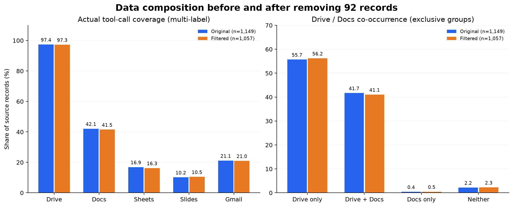
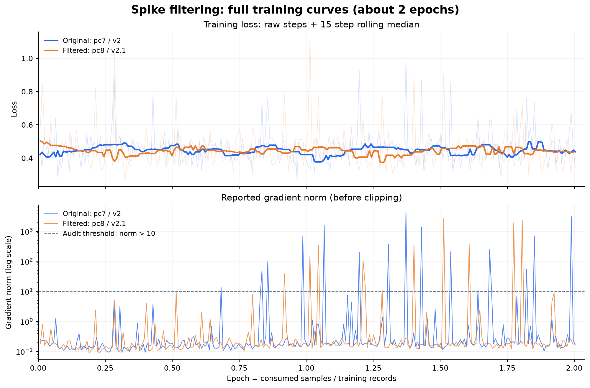
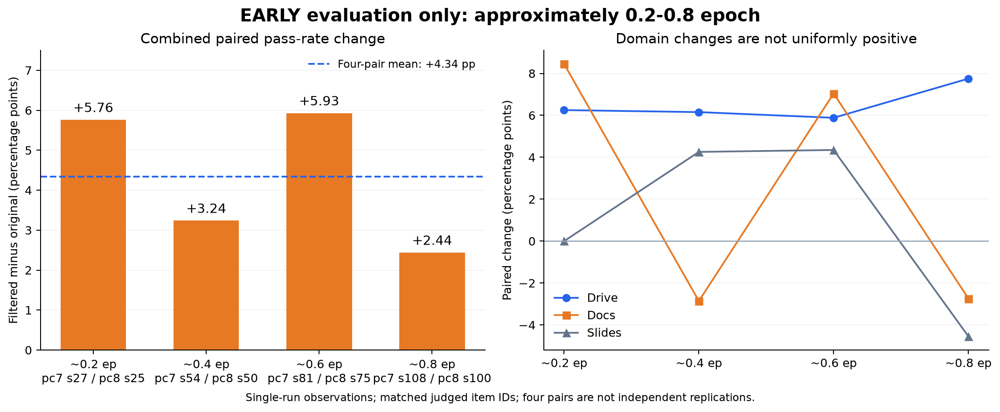

# 去 Spike 数据实验：pc7 / v2 → pc8 / v2.1

核验日期：2026-09-16。本文只报告约 **0.2–0.8 epoch 的前期评测增益**；训练曲线展示两次完整运行，约 2 epoch。对照是原版数据训练后的 pc7，不是未训练 baseline，也不混入其他训练项目。

## 一句话结论

删除 92 条数据（8.01%）后，主要工具分布基本不变；梯度尖峰减少、峰值降低，但没有消失，loss 整体接近。前期四档同题对比的综合通过率均高于原版训练，增益为 **+2.44～+5.93 个百分点，四档平均 +4.34 个百分点**。这是单轮观察，尚不足以证明稳定或统计显著提升，不能外推为最终模型效果。

## 1. 去除前后：少了多少，分布怎样

全量逐条核验 `v2.jsonl.gz` 与 `v2.1.jsonl.gz`：两份文件内记录均唯一，过滤后是原始文件的严格子集；**删除 92 条，新增 0 条，保留记录没有改写**。

| 数据环节 | 原版 v2 / pc7 | 去 Spike v2.1 / pc8 |
|---|---:|---:|
| 源文件记录 | 1,149 | 1,057 |
| 预处理超长丢弃（>98,304 token） | 15 | 15 |
| 预处理保留 | 1,134 | 1,042 |
| Train / Val | 1,102 / 32 | 1,010 / 32 |
| Train token 总数 | 75,370,567 | 68,838,516 |
| Train 长度中位数 | 67,541 | 67,469 |
| 直接监督 token 占比 | 5.02% | 5.00% |

两边 Val 都是 32 条，但尚未逐成员核对，**不能说是同一批验证数据**。下图统计的是完整源文件，不是训练 split；不能拿源记录数与预处理后记录数混比。

按实际工具调用统计，不把工具 schema 或正文里出现的名称算作调用。每条记录可以包含多类工具，因此左图比例不相加为 100%；右图四组互斥。

- Drive：1,119 → 1,028 条，97.39% → 97.26%。
- Docs：484 → 439 条，42.12% → 41.53%。
- Sheets：194 → 172 条，16.88% → 16.27%。
- Slides：117 → 111 条，10.18% → 10.50%。
- Gmail：243 → 222 条，21.15% → 21.00%。

上述工具族的覆盖比例变化均不到 1 个百分点。Drive only 为 640 → 594，Drive+Docs 为 479 → 434；Docs only 保持 5 条，Neither 为 25 → 24。总体仍以 Drive 为主，没有大幅改变工具构成。

包括其他工具在内的实际调用总数为 8,700 → 7,957，每条调用数 p50 / p90 为 6 / 16 → 6 / 15，最大值都为 39。被删 92 条的调用数中位数为 7，略高于总体；删除集合中 Docs、Sheets 的覆盖比例略高于原始整体。这里衡量的是工具覆盖和调用复杂度，不代表已识别真实/合成配比或全部语义任务分布。

## 2. 当时怎么去除，现在能验证到哪里

历史 `数据版本说明.md` 与 [Pro 流程记录](../../source-materials/notion/pro-flow.md#v2)将 v2.1 明确标为“去掉 v2 的 grad norm 尖峰数据”，对应 pc8。版本说明记录使用 **assistant 的 content + reasoning_content 的 MD5** 定位并删除 92 条。

历史尖峰分析把跨机器复现的异常 step 作为排查线索，并讨论 `grad norm > 10`。但第二个 epoch 有 shuffle，不能仅按 step × batch size 直接反推出对应原始行。**原始候选选择脚本、完整的 spike → 样本映射仍未找到**，所以不能写成“把所有超过阈值的样本机械删除”，也不能断言这 92 条全是坏数据。

本次补齐的是可复现的事后核验：

1. 对整条 JSON 记录做键排序规范化，再计算 SHA-256，以多重集合做前后差分，独立确认严格子集和 92 条删除。
2. 输出 [92 条删除指纹清单](artifacts/removed_fingerprints.csv)，含源文件行号、整行 SHA-256、重建的 assistant MD5 和调用次数，不含消息原文。
3. 仅解析真实 `tool_call`，展开 `proxy_tool.arguments.tool_name`，重算上述分布。

[核验脚本](../../../scripts/spike/audit_data.py)是本次新写的，不是找回的历史过滤脚本。MD5 拼接也明确是事后复建：逐条 assistant 的 content 后接 reasoning_content、无分隔符；历史实现细节未全部保留。整行 SHA-256 差分不依赖这项假设。首条 user 内容并不唯一，不适合作为记录身份。

## 3. 实际训练用了哪份数据

本次交叉核对源文件指纹、`data_prochain_v7/meta.json` / `data_prochain_v8/meta.json`、`train_prochain_v7.sh` / `train_prochain_v8.sh` 及对应 run 的实际日志。

- 原版：v2 → `data_prochain_v7` → `out_prochain_v7_r16_98k_0826`，Train 1,102 条，276 步。
- 过滤版：v2.1（训练侧源文件名为 `prochain_v8_nospike.jsonl.gz`）→ `data_prochain_v8` → `out_prochain_v8_r16_98k_0827`，Train 1,010 条，252 步。

两版源文件的完整 SHA-256 保存在 [data_summary.json](artifacts/data_summary.json)，训练日志 SHA-256 与目录名保存在 [training_summary.json](artifacts/training_summary.json)。[数据到训练绑定摘要](artifacts/binding_summary.json)另附 meta / 启动脚本指纹，以及日志中数据路径与数量的证据行号。公开仓库不新增原始轨迹、完整内部日志或带账号/服务配置的启动脚本；只保留审计结果和数值曲线。

共同配方为 DeepSeek-V4-Flash-0731、LoRA rank 16 / alpha 32 / dropout 0.05、98,304 上下文、global batch 8、学习率 1e-4 → 1e-5 cosine、seed 42、`clip_grad=1.0`、约 2 epoch。数据量变化带来不同的更新步数；相近 epoch 不等于完全相同的训练过程，也不是多随机种子消融。

仓库原有 [Milly 0827 复跑记录](../../source-materials/artifacts/pro-v7/training-run/README.md)是另一次运行，不能替代这里的历史 pc7 日志；两者的梯度峰值等读数不同。

## 4. 训练曲线怎样变化

横轴按已消费样本 / Train 样本数换算 epoch，不直接比较同一步数。上图淡线为原始 loss，实线为居中的 15 步滚动中位数；下图为裁剪前梯度范数，对数坐标，虚线为本次统计阈值 10。

- `grad norm > 10`：16 / 276 步 → 11 / 252 步，占比 **5.80% → 4.37%**；绝对次数减少 31.25%。
- 梯度峰值：4,405.749 → 2,640.981，降低约 **40.06%**；中位数 0.171 → 0.1705，基本相同。
- 平均 loss：0.4598 → 0.4602；loss 中位数 0.4498 → 0.4456，整体接近。
- 两次运行 NaN 和跳步计数均为 0。

因此可以说“异常梯度事件减少，但未消除”，不能说“清洗后完全平滑”或“loss 明显下降”。日志中的范数在裁剪前，不等于模型实际按该幅度更新参数。

## 5. 前期增益：直接对比原版训练

| 约 epoch | 原版 pc7 → 过滤版 pc8 | 共同已判题数 | 综合通过率变化 |
|---|---|---:|---:|
| 0.2 | s27 → s25 | 243 | +5.76pp |
| 0.4 | s54 → s50 | 247 | +3.24pp |
| 0.6 | s81 → s75 | 253 | +5.93pp |
| 0.8 | s108 → s100 | 246 | +2.44pp |

综合指每组 Drive、Docs、Slides 共同题的微平均，不是三域宏平均。四组变化的算术平均为 **+4.34pp**；Drive 四档均为正向，Docs 和 Slides 有正有负。它不是“所有能力都提高”。

比较方法和限制：

- 使用现存评测 run 与判官缓存，仅对双方均有 PASS/FAIL 的同一 `item_id` 配对；没有重新调用判官或重跑评测。未配对和未判题不纳入这个分母，结果不是所有提交题的全量通过率，缺失可能带来偏差。
- pc7 固定首轮 a1；s108 两个同名 a1 中固定 2026-08-27 02 时首轮。pc8 的 s25/s50 用 b1，s75/s100 用 a1；run 文件名、指纹及已判数量见 [early_evaluation.json](artifacts/early_evaluation.json)。
- 四档是同一次训练沿途 checkpoint，不是四次独立实验；+4.34pp 是描述性均值，不据此计算独立重复实验的置信区间。
- 四组综合配对的精确 McNemar 检验经 Holm 校正后均未达 0.05，最小约 0.143。应说“前期观察到提升”，不能说“已证实显著、稳定提升”。

**仅报告这个前期区间，不对后期或最终 checkpoint 作效果结论。** 也不再使用 pc8 s75 与 pc7 s162 三次均值的跨 epoch 比较来概括过滤收益。

## 6. 可复现材料

[复现说明](../../../scripts/spike/README.md)包括数据差分、训练日志数值提取、前期同题评测核验和三张图的生成命令。绘图只需仓库内聚合文件；重新审计需自行提供有权限访问的本地原始文件。

本次未重新训练模型或执行线上评测。未上传原始 JSONL、评测 case 文本、判官缓存、完整日志、权重或任何 SSH 密钥。
