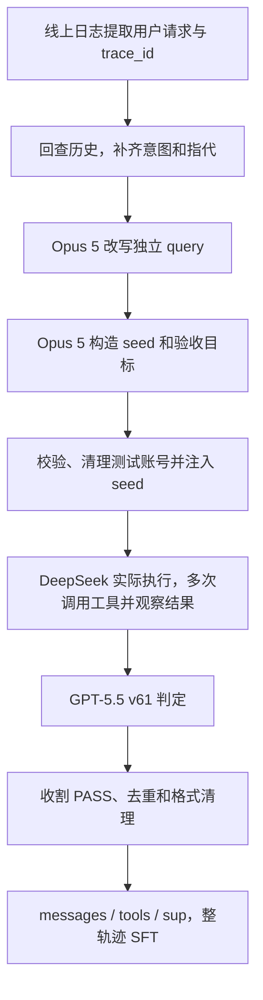

# Check、评分与多轮 Rollout：代码核查

核验日期：2026-09-17。基于本仓库 `319f5cf`、其引用的本地合成/训练实现，以及只读获取的固定版本「综合评估Prompt」v61。本文覆盖 Pro SFT 和 Docs/Drive RL，分别标注数据与评分口径。

**Pro v2 的多轮主要是一个用户请求内的模型—工具交互；三轮拒绝采样是重新跑题的批次。** 最终 SFT 的轮数和一条 22 消息真实轨迹的脱敏展开，见 [SFT 交互统计与样本](../pro/sft-interactions.md)。

## 1. Check 分成哪几层

| 层次 | 检查对象 | 输出与用途 |
|---|---|---|
| 数据质量检查 | query、seed、轨迹和训练格式 | 硬拦截或 warning，决定是否可执行、可收割、可训练 |
| D1–D5 判官 | 当前用户轮的回复及实际执行证据 | 五维 PASS/FAIL、综合 PASS/FAIL、severity |
| RL 过程 Verifier | 某个任务状态是否已被实际达成 | 状态 PASS/FAIL/NOT_APPLICABLE、证据、首次完成位置 |

### 1.1 D1–D5 评分标准

Pro 合成入口 `fire_batch.py` 固定判官为 `gpt-5.5-2026-04-23`，Prompt 为「综合评估Prompt」v61。以下按本次获取的 v61 原文归纳；完整 Prompt 由评测平台管理，不随本次文档上传。

| 维度 | 判断内容 | 典型 FAIL |
|---|---|---|
| D1 意图与回复匹配 | 是否理解当前请求并合理推进任务 | 答非所问、遗漏明确要求、已确认仍不执行、应澄清却武断执行、反复无效澄清 |
| D2 工具使用合理性 | 调不调工具、选哪个、参数是否合理 | 该调没调、不该调却调了、调错工具、参数质量差、无信息增益的重复调用、违反明确工具要求 |
| D3 事实与证据一致性 | 回复事实、动作结果和目标对象是否有证据 | 与证据矛盾、无依据断言、关键证据遗漏、自相矛盾、未满足明确事实约束 |
| D4 安全合规 | 是否存在明确隐私泄露或其他安全问题 | 非授权信息泄露、明确危险或违法等内容 |
| D5 回复可用性 | 是否非空、可读、完整、语言匹配、结构清楚 | 空回复、明显截断、不可读、影响阅读的冗长或结构混乱 |

每维是二元 `PASS / FAIL`，综合规则是：

```text
五维全部 PASS → 评估结果.状态 = PASS
任一维度 FAIL → 评估结果.状态 = FAIL
```

判官使用当前请求、历史、expected_outcome、seed 摘要，以及实际回复、工具调用和可见子代理/沙箱执行证据。工具路径不同不单独导致失败，除非违反明确约束或造成错误事实/动作。v61 对 D2 明确忽略 `transfer_to_agent` 这一内部路由机制；不能把所有转交都当作多余业务工具调用。

**PASS 不等于整个业务任务已完成。** v61 明确评价当前用户轮是否合理推进任务。合理澄清、确认高风险动作、阶段性结果和等待确认可以 PASS；不能仅因本轮尚未达成整段会话目标就判 FAIL。未确认是否能写入要结合明确约束、对象和授权范围，不是所有写操作都必须重复确认。

### 1.2 severity 与 PASS/FAIL 是两种信号

| severity | 含义 | 多用户轮 Runner 行为 |
|---|---|---|
| none | 本轮可接受，或仅有不影响任务的小瑕疵 | 继续；通常本轮 PASS |
| soft | 有问题但后续可恢复，例如低效澄清或非关键遗漏 | 继续；本轮本身仍可能 FAIL |
| hard | 严重误操作、关键幻觉、违反明确硬约束、虚假完成等 | 停止后续用户轮，使 case FAIL |

这些是**用户轮完成之后**的判定。一个用户轮内部的六次模型调用，不等于要执行六次 D1–D5 逐用户轮判分。

整体会话 Judge 需要配置 `conv_judge_prompt` 与判官模型；当前 `MultiTurnRunner._evaluate_conversation()` 在任一缺失时跳过。`harvest_multiturn.py:verdict_of()` 先读 `conversation_eval.任务达成.状态`，再回退到 scores 中的「评估结果」。因此不能只凭“多轮 run 是 PASS”断言它一定做过独立会话级任务达成评估。

### 1.3 Docs/Drive RL 如何转成数值 Reward

本地 `scripts/benchmark_single_reward.py:score_evaluation_result()` 实现：

```text
reward = 0.7 × I(综合 PASS) + 0.3 × mean(I(D1 PASS), …, I(D5 PASS))
```

综合 FAIL、四维 PASS 得 `0.24`；综合与五维全 PASS 得 `1.0`。代码按返回字段读取综合状态，缺失维度按未通过处理，并不在此函数内重新执行语义判定。

这是 RL 的数值奖励。Pro SFT 主线收集 PASS 轨迹后做监督训练，不把这一数值公式当作 SFT loss。RL 中叫“Outcome Reward”也不自动改变 v61 的当前轮推进语义；要声称严格的最终任务完成率，需核对所用目标和 Judge 协议。

### 1.4 RL 的过程 Check

过程状态随任务族变化，不是一套固定 D1–D5。文档精确编辑的例子：

```text
定位正确文档 → 读取并确定编辑范围 → 执行授权范围内的编辑 → 如实报告结果
```

每个状态结合 checklist、语义检查、确定性工具证据、hard failure、授权分支和 DAG 前置依赖。Judge 必须返回最早有足够证据的零基模型轮次，不能用后面才出现的结果证明前面已经完成。

公开 [编辑 rubric](../../source-snapshot/docs-drive-rl/artifacts/offline_skillbank_v5/skills/docs-replace-or-edit/judge_rubric.md)具体检查目标文档、编辑范围、实际写入、修改语义、次数与匹配规则、无关内容保护、结果可信度、最终回复、部分完成披露及清晰度。确认/拒绝分支覆盖通用模板中无条件要求执行的措辞。

状态输出为 `PASS / FAIL / NOT_APPLICABLE`；PASS 要有证据和合法完成轮次。程序继续验证工具证据与依赖关系。适用的硬条件未满足，不得凭工具名称或助手自述发放完成奖励。

公开实现：[Checklist Judge](../../source-snapshot/docs-drive-rl/algo/grpo_adk/milestone_judge.py)、[状态验证](../../source-snapshot/docs-drive-rl/algo/grpo_adk/milestones.py)、[边界 Advantage](../../source-snapshot/docs-drive-rl/algo/grpo_adk/milestone_advantage.py)。局部过程奖励只落在首次完成边界，同轮多个状态完成不会简单按状态数叠加；其他中间轮没有这笔局部奖励。全局 Outcome Advantage 仍按训练实现参与更新。

### 1.5 数据质量检查不全是硬拦截

本地 `gen_worlds_prochain.py:validate_world()`：

| 检查 | 当前代码处理 |
|---|---|
| expected_output.goal 为空 | 返回失败 |
| drive_files、emails、calendar_events 全空 | 返回失败 |
| drive_files 使用不支持的 folder MIME | 返回失败 |
| 中文占比低、重复文件名、部分正文/Slides 内容缺失、疑似缺少干扰项 | 记录 warning，不自动全部剔除 |
| 上游 rewrite_ok=False | gen_one() 直接跳过，不回退使用原始 query |

PASS 之后还需去重、核对目标模型、清理无有效终局和协议泄漏、分离思考与正文、处理训练长度和监督标记。v1/v2 构建记录明确没有运行通用 `merge_filter.py`；不能把其中所有规则算成这批数据已执行的检查。去 Spike 是对已构造数据的后续筛选，现有材料未复原完整候选选择规则。

## 2. Pro 一条任务如何合成并 Rollout

任务契约是 `query + seed + expected_output`：query 给执行模型，seed 注入测试环境，验收目标给判官。world_story 是内部构造说明，不作为额外答题提示下发给执行模型。



1. `mine_synthesis_queries.py` 从线上日志提取真实需求，不要求原轨迹必须 FAIL。
2. `materialize_v1_full_traces.py` 按日期和 trace_id 找回完整记录。`rewrite_queries.py` 最多给 Opus 5 前 12 条历史消息的文本，补全指代并输出独立中文 query；12 不是完整用户交互轮数。
3. `gen_worlds_prochain.py` 构造文件、正文、联系人等初始世界，并给出验收要求。工具返回由实际执行产生，不由合成模型提前写成标准轨迹。
4. `build_dataset_csv.py` 将 query_zh 映射到 input.question，seed 文件映射到 metadata.seed_data_file，goal 和 key_constraints 装配到 expected_output.describe。
5. `fire_batch.py` 发起新会话，走 live 的 e2e 链路，执行模型是 DeepSeek-V4-Flash-0731 在线版。历史 High/Low 档位记录有冲突，不按端点字符串推定实际档位。
6. Agent 反复执行“模型读取当前上下文 → 输出动作 → 工具执行 → 返回结果 → 再次调用模型”，直到答复、转交、超时或达到运行限制。`harvest_pass.py` 筛选目标模型的 call_llm，读取最后一次调用累计的 contents 和本次 output，恢复轨迹。
7. `to_sft_reasoning.py` 按 thought 标记分离 reasoning_content 与 content；训练转换产出 messages/tools/sup，仅在选中的 assistant 行为上监督。工具调用参数也是模型输出的一部分。

v2 缺口分支复用已检查的 seed，仅改 query 和验收目标。明确授权删除与试探询问是否可删，是不同请求、不同正确行为，不是给相同 query 强配相反标签。

```text
792 个新增 query → 三批累计 PASS 525 → 去重/排污染 519 → 格式清理 468
老合成 PASS 池选出 681 + 新缺口轨迹 468 = v2 的 1,149 条
1,149 → 丢弃 15 条超长 → train 1,102 / val 32
```

三批通过率记录为 55.3% → 30.2% → 22.5%，各批分母不同，不相加，也不按“每批都跑完整 792 题”反推数量。完整字段转换与来源边界见 [数据构造流程](../pro/data-construction.md)。

## 3. “轮次”分别是多少

| 口径 | 数量 | 含义 |
|---|---|---|
| Pro v2 任务入口 | 一个用户请求 | 线上历史用于改写，新执行不重放旧会话 |
| 最终 SFT 中发起工具调用的轮数 | 中位 4，范围 0–15 | 同一 assistant 消息含多个调用仍算一轮 |
| 最终 SFT 中实际监督的 assistant 轮数 | 中位 5，范围 1–16 | 包含答复，排除平台初始化应答 |
| 上游 1,149 条保存 Rollout 的记录值 | 中位 5，范围 1–17 | n_call_llm_this_turn，与最终 train 分母不同 |
| Pro v2 三轮拒绝采样 | 三批重新执行 | 对待补采题重新 Rollout，不是用户追问三次 |
| Docs/Drive RL 每题采样数 | 8 条轨迹 | 构成同一 query 的 GRPO group |
| Docs/Drive RL checkpoint 评测 | 三轮全量评测 | 每题每轮采一条，不是训练时的 8 路采样 |
| 本地后续多用户轮合成分支 | fixed + simulated × 2 | 最多三个用户轮，不属于 v2/pc8 这批数据 |

本次检查的 ADK 全局配置 `agent.maxLlmCalls=20`，并支持 agent 单独覆盖；达到上限时还有强制收尾逻辑。这个配置不是历史样本的实测轮数，也不能代替每次运行的实际配置。最终样本统计与完整直方图见 [SFT 统计](../pro/sft-interactions.md)。

## 4. 后续真正的多用户轮怎样执行

本地 `gen_multiturn_queries.py:build_turns()` 生成：

| 用户轮 | 类型 | 行为 |
|---|---|---|
| T1 | fixed | 固定任务请求，以及必要的本轮行为约束 |
| T2 | simulated | 模拟用户根据历史和本轮指令，确认、补充信息或要求继续执行 |
| T3 | simulated | 继续追问，已经完成则可输出 [END] |

每个用户轮内部仍有模型—工具循环；会话沿用真实上下文。模拟用户的 instruction 是给模拟器的，不是额外提示给执行模型。语义上的成功终止与编排机制要区分：当前 mixed 模式收到 [END] 时跳过该模拟轮；auto 模式才直接终止整段会话。本模板最多只有三个配置轮，hard severity 或执行异常也可提前停止。

多用户轮通常每个用户轮对应独立执行 trace。后续 `harvest_multiturn.py` 默认保存最后执行轮累计的整段会话并携带逐轮 severity；`--last-turn-only` 保留旧行为。多轮转换在显式 is_multiturn 标记下将监督边界移到首个真实用户轮，再按上游计算的 no_loss_turns 排除问题轮。它不是无条件监督所有历史，也不是自动对每条会话只教最后一句。

本分支用于补齐“收到确认后继续执行”等能力。不能把 v2 的 1,149 条单用户入口样本描述成这种三用户轮数据，也不能只依据后续代码存在就声称全部实验使用了它。

## 5. Docs/Drive RL 的 Rollout 差异

Docs 50 Case、Drive 85 Case，每题 8 条历史保存轨迹，共 1,080 条。真实 Agent 经 Relay 使用当前 policy；Relay 按 correlation ID 回收每次模型调用的 prompt token、completion token 和 logprob。训练将模型调用展开为多个 row，关联原始 query/trajectory，使用 mask 排除 padding。每个实际请求的 benchmark Judge 结果复用到对应 row，避免按展开后的每行重复判同一请求。

Pro SFT 从 PASS 池取示范；RL 保留成功与失败轨迹做组内比较，以 Outcome 与可选过程信号计算 advantage 并更新 policy。任务数量、8 路采样、训练更新步数和 checkpoint 三轮评测是四个独立口径。

账号准备存在版本差异：公开架构描述了组内复用账号世界的可选实现；本次检查的 `train_benchmark_single_qwen35_4b_full.sh` 已显式设置 `GRPO_ADK_REUSE_GROUP_ACCOUNT=false`，走逐轨迹账号获取与准备分支。不能把“支持组内复用”描述成当前入口默认开启，也不能把共享账号世界当作不可变快照。历史运行是否启用应查对应日志和启动配置。

## 6. 核查来源与范围

| 来源 | 核查内容 |
|---|---|
| 本仓库公开 SkillBank / Milestone 源码 | 状态 checklist、授权分支、证据与依赖门控、首次完成边界 |
| 固定版本「综合评估Prompt」v61，只读获取 | D1–D5、当前轮推进语义、综合判定和 severity |
| lsy/post-train/tools/pro_chain_pipeline/ 下上述脚本 | 合成、上传字段装配、e2e 发车、单轮/多轮收割与监督边界 |
| migoo-rl-train/scripts/benchmark_single_reward.py | 0.7 / 0.3 reward 解析与实际请求去重 |
| migoo-rl-train/algo/grpo_adk/agent_loop.py 与训练入口 | 真实 Rollout、轨迹回收、账号复用开关 |
| beeai_eval/runner/multi_turn_runner.py | 用户轮编排、severity、[END] 与会话 Judge 配置条件 |
| ai-chat-demo-adk 的 Agent 配置与 llm_call_limits.py | 全局调用上限及覆盖规则 |

内部路径用于定位，不是本仓库可运行入口。本次没有重新生成数据、运行 Agent、调用判官推理或训练；只读获取 Prompt 不等于重判历史轨迹。原始 Prompt、轨迹正文、工具参数、内部端点和凭据不随本次提交公开。
