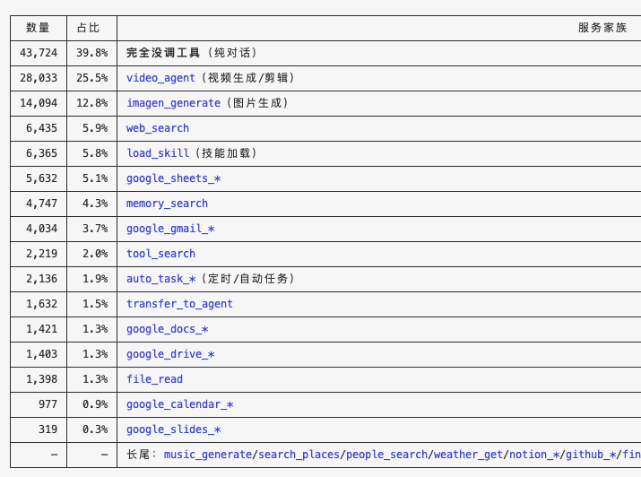

# 主链路Pro流程梳理和训练记录

[主链Pro评测结果汇总](pro-benchmark-summary.md)

# 1 router 分发给 Professional 模型的任务类型

| 信号 | 例子 |
| --- | --- |
| 当前性 | “今天”“最新”“现在”“近期”，需要搜索实时信息 |
| 个人性 | “我的日历”“我邮箱里”，需读用户私有数据 |
| 外部动作 | “发给 Leo”“帮我建会议”，需调用工具 |
| 长期记忆 | “记住我喜欢……”，需安全写入记忆 |
| 时间/地点精确计算 | “新加坡下午 3 点是纽约几点”，当前规则中倾向走 Pro 的时间解析能力 |
| 不确定 | router 没有把握保守走 Pro，避免 Lite 无工具却答错 |
| 生成式多模态 or 理解用户上传的多模态 | “画一只猫”“生成海报”“制作视频”“做一段背景音乐”//“总结这张截图”… |

# 2 Pro 链路涉及的 Tool Call

完整工具空间：32 常挂 + 8 延迟 + 150 左右的 Google 套件 + proxy_tool 背后 191 种。

| 常挂 | 32 | transfer_to_agent / proxy_tool / tool_search
memory_* / file_read / temporal_resolve / web_search / video_agent / load_connector
google_calendar_* / google_docs_cat / google_drive_* / google_gmail_* / google_sheets_* / google_slides_* / skill 相关：load_skill / load_skill_resource |
| --- | --- | --- |
| 延迟工具 | tool_search（8） | auto_task_create/delete/search/update, channel_list,
flight_search_google_flights, hierarchy_node_search, weather_get |
| 延迟工具 | proxy_tool | imagen_generate/ auto_task_update / auto_task_create / auto_task_search / weather_get / people_search_by_id/  search_places / music_generate…… |

头部工具：



按类型划分：

| 用户记忆与身份信息 | `memory_search、memory_save、memory_count、hierarchy_node_search、lookup_my_credential` |
| --- | --- |
| Gmail 邮件 | `gmail_search 、gmail_message_get 、gmail_thread_get、gmail_attachment_get、gmail_draft_create、gmail_message_reply、gmail_message_forward、gmail_message_send、gmail_message_label_update` |
| Calendar 日历 | `calendar_list、calendar_event_get、calendar_freebusy_check、calendar_availability_find、calendar_event_create、calendar_event_update、calendar_event_delete` |
| Drive 与文件 | `gdrive_file_search、gdrive_file_get、gdrive_file_create、file_context_get` |
| 联系人 | `contact_list、contact_search、contact_get、contact_manage、contact_other_list、contact_other_search、contact_other_get、contact_other_manage` |
| 自动任务与提醒 | `auto_task_search、auto_task_create、auto_task_update、auto_task_delete` |
| 天气 | `weather_get` |

# 3 pro链路中的子agent转发

需要注意转交出去之后如何收尾，三种方式：

1. 回复内容主链路是否还会再读
2. 假回调收尾
3. 不需要收尾

| 子agent | 作用 | 如何收尾 |
| --- | --- | --- |
| `web_search` | 查实时网页、新闻、价格 | 主链拿到返回后真的再让模型读一遍，然后组织答复 |
| `video_agent` | 视频创作的规划、素材处理、生成 | 假收尾：内容不回主链路 |
| `sandbox_runner` |  | 转过去就不回来了，主链的轨迹在 transfer_to_agent 那一步结束 |
| `query_personal_database` | 查询用户结构化个人数据，当前代码描述主要是个人财务 | 线上还没这个 |

# 4 Trace数据特征

- 统计维度为天级别，每天大概数据量级，源teace 50-60k，经初步过滤，去除附件上传等量级10-20k/天

    


## 4.1 tool call次数统计

- tool call次数分布50% 的 trace 只有 1 个主链 call_llm —— 模型直接回答，一个工具都没调，需要具体看一下原因

| 模型调用轮数 | trace 数 | 占比 | 最后一轮做了什么 |
| --- | --- | --- | --- |
| 1 轮 | 29,313 | 59.3% | 直接给出文字答复 87% · 发出工具调用 9% · 转交子 agent 4%， |
| 2 轮 | 10,397 | 21.0% | 直接答复 96% |
| 3 轮 | 4,455 | 9.0% | 直接答复 94% |
| 4 轮 | 2,617 | 5.3% | 直接答复 92% |
| 5 轮 | 1,197 | 2.4% | 直接答复 90% |
| 6+ 轮 | 1,428 | 2.9% | 直接答复 86% |

## 4.2 典型工具调用链

- 延迟加载链

<aside>

tool_search  → proxy_tool   (422)
proxy_tool   → tool_search  (166)   ← 双向,边找边用
tool_search  → transfer_to_agent (131)

</aside>

- 技能加载链

<aside>

load_skill → load_skill_resource (433) → proxy_tool (378)
load_skill → proxy_tool (706)

</aside>

- Google 工作流

<aside>

google_sheets_metadata → google_sheets_get (207) → google_sheets_update (158)
google_gmail_search → google_gmail_thread_get (174)
memory_search → google_gmail_search (190)
google_calendar_events → temporal_resolve (95)

</aside>

- 入口 / 收尾top tool

<aside>

入口 top5:  proxy_tool 1,961 | load_skill 1,326 | video_agent 769 | memory_search 676 | web_search 537
收尾 top5:  proxy_tool 3,195 | video_agent 759 | transfer_to_agent 736 | web_search 558 | memory_search 421

</aside>

## 4.3 历史对话拼接轮次

| **轮次** | **占比** |
| --- | --- |
| 0 轮  | 15.8%   ← 全新会话 |
| 1-3 轮 | 16.1% |
| 4-5 轮 | 20.2% |
| 6-9 轮 | 23.1% |
| 10+ 轮 | 24.8% |
- 中位数 5~6 轮历史，四分之一超过 10 轮，没有硬性截断（max 207 条 contents）。
- 上下文里带的历史相当长，终点步的 input 中位数有 20 万字符。

vsession概念


## 4.4 数据中session共享情况

- 样本19,096，不同 session 6,865，平均 2.8 条/session
- 同一段对话内容会在后续样本里反复作为历史出现，40.4% 的样本来自多轮 session，最多一个session 贡献102条样本

| 样本条数 / session | session 数 | 累计占比 |
| --- | --- | --- |
| 1 条 | 4,090 | 59.6% |
| 2 条 | 942 | 73.3% |
| 3 条 | 523 | 80.9% |
| 4 条 | 335 | 85.8% |
| 5 条 | 220 | 89.0% |
| 6~9 条 | 450 | 95.6% |
| 10+ 条 | 305 | 100% |

## 4.4 上下文注入和历史对话设计

8种膨胀控制：

| 机制 | 触发 | 行为 |
| --- | --- | --- |
| 历史过滤 | 每次读取 | 旧轮去结构化，只留文本/受限工具信息 |
| tool result 限长 | history/QRC | 2000 字符 ← 我只知道这个 |
| QRC 压缩 | Tools+Answer ≥300 字符 | 用专用 LLM 压缩，包括模型的答复 |
| 动态记忆预算 | maxDynamicInjectMemoryTokens=1000 | 多源 memory 按 token 截断 |
| Context compressor | prompt token > 上下文 × 0.8 | 压缩 function responses，优先保留 summaryContent |
| 内联图片压缩 | 出站前 | 压缩超阈值图片 |
| token-limit retry | provider 超限 | 丢弃较早 content 后重试 |
| OSC checker | 独立预算 | 结构化截断（不改主 agent 输入） |

所以一条样本的历史上下文实际上是2部分拼出来的：QRC召回和最近5轮

| 位置 | 内容类型 | 说明 |
| --- | --- | --- |
| user | Frozen QRC | Redis，按当前 query 召回；最多 5 对 user/model；TTL 30 天、存 100 条、召回 15 候选；Tools+Answer ≥300 字符时被专用 LLM 压缩过，工具过程被压成一句自然语言 |
| user | Native Session History | Session 的过滤后 history；最近 5 轮、48 小时内；工具返回截到 2000 字符 |
| user | 当前轮 User Content |  |

```markdown
## 一、完整布局

```
┌─ system_instruction ────────────────────────────────────────────┐
│  55,548 字的规则手册                                              │  独立字段，不在 contents 里
│  （角色 / 硬约束 / 执行协议 / 话术 / 输出纪律 / 安全）              │  每条样本几乎一样
└─────────────────────────────────────────────────────────────────┘
┌─ tools ─────────────────────────────────────────────────────────┐
│  32 个常驻工具的 name + description + parameters                  │  独立字段
│  序列化后 141,001 字                                              │  每条样本几乎一样
└─────────────────────────────────────────────────────────────────┘

contents:
┌─ [0] 稳定 Preamble ──────────────────── role: user ─────────────┐
│  <skills>       16 个技能的清单和用法                             │  每个会话固定
│  <connectors>   Notion / Slack / GitHub… 连没连                  │  不随提问变化
│  <user-context> 邮箱、时区、记忆覆盖窗口、用户画像                 │
│                                                                  │  实测 100% 是这个
└─────────────────────────────────────────────────────────────────┘
┌─ [1] 固定应答 ───────────────────────── role: model ────────────┐
│  "System initialized. User profile and session protocols have    │  平台硬编码的假回复
│   been synchronized. I am ready to assist..."                    │  模型从没生成过
│                                                                  │
│  为什么存在：协议要求 user/model 交替，[0] 和 [2] 都是 user，      │  实测 100% 是这个
│  中间不插一条 model 就违反交替                                    │  每条样本出现且仅出现 1 次
└─────────────────────────────────────────────────────────────────┘
┌─ [2..K] 早期历史召回（QRC）────────── user / model 成对 ────────┐
│  user : <msg_time>7月31日</msg_time> 上一份周报重点关注什么？      │  最多 5 对
│  model: 上一份周报重点关注 2.8.0 发布准备、支付链路回归…           │
│                                                                  │  存在 Redis
│  ⚠️ 纯文字，没有结构化的工具块 ——                                 │  30 天 / 100 条
│     工具调了什么、返回了什么，被专用模型压缩成了                    │  召回 15 候选
│     model 那句话里的一段自然语言                                   │  按当前提问选相关的
└─────────────────────────────────────────────────────────────────┘
┌─ [K+1..N] 最近对话 ─────────────────── 真实历史 ────────────────┐
│  user : <msg_time>8月6日</msg_time> 本周发布目标是 2.8.0…         │  最近 5 轮（上限 10）
│  model: [推理文字] + [调用 google_calendar_events]                │  且必须在 48 小时内
│  user : [工具返回]  ← 超过 2000 字会被截断                        │
│  model: 已记录：2.8.0 计划 8 月 14 日开始灰度                      │  结构完整
│  ... 重复若干轮 ...                                               │
└─────────────────────────────────────────────────────────────────┘
┌─ [N+1] 当前这一轮 ───────────────────── role: user ─────────────┐
│  <system-reminder>   延迟工具清单、并行任务状态                    │  ← loss 边界在这条
│  <available_tools>   本轮临时召回的低频工具的完整说明               │
│  <query-context>     按这句话召回的记忆（邮件 / 日程 / 联系人）      │  每一轮实时算
│  <knowledge-context> 按这句话召回的产品知识                        │  内容每轮都不同
│  <temporal_context>  小模型预先解析好的时间                        │
│  <msg_time>8月19日</msg_time>                                     │
│  帮我在「财务」下面创建一个子标签「财务/报销」        ← 用户真正打的字 │
└─────────────────────────────────────────────────────────────────┘

              ↓ 模型的输出（这才是训练目标）

  [推理文字] + [调用 tool_search] → 工具返回
  [推理文字] + [调用 google_gmail_batch_modify] → 工具返回
  <start_answer>已经打上标签了…</start_answer>
```
```

- 压缩问题sft数据保留与推理一致

历史轮tool response压缩规则：

| 对象 | 处理 |
| --- | --- |
| 当前轮 | 原样保留（只剥掉 summaryContent，那是给压缩用的） |
| 历史轮的 function_call | 完整保留 |
| 历史轮的 function_response，在白名单里 | 完整保留。白名单：load_skill、load_skill_resource、tool_search、load_google_tools、load_lazy_tools、load_connector、video_agent、prepare_face_video_generation、confirm_face_video_preference |
| 历史轮的 function_response，不在白名单里 | 会被压缩，压缩规则：1）有 summaryContent-用摘要替换原文，2）无摘要且 < 2000 字符-原样，3）无摘要且 ≥ 2000 字符-截断到 2000 / 换成占位符[...truncated, {len(response_str)} chars total]，截断后的 JSON 结构是坏的（从中间某个字符硬切）但如果下游有对 tool_response 做 JSON 解析的清洗步骤，会在这批上报错 |
- summaryContent 是什么

每次调工具自己返回的一段概括，工具（主要是 MCP / gogcli 等）在返回结果时，除了完整内容，还额外带一份精简版，预先写好"这次调用干了什么"的一句话，不是事后 LLM 压缩出来的。

```json
{
  "function_response": {
    "name": "google_sheets_get",
    "response": {
      "result": "...完整的 933 行表格数据...",  --当前轮用这个
      "_summaryContent": [
        {
          "type": "text",
          "text": "读取了 Scrubbing 表 A1:Y933，933 行 25 列" --历史轮用这个
        }
      ]
    }
  }
}
```

# 4 后续训练的入手场景

- P0计划：优先不涉及文件上传、不涉及多模态的场景
- 训练产品特有的行为pattern：如生成邮件需要先打草稿，用户确认后再走真正发送

# 6 数据注意问题

## 6.1 用户上传附件存储问题

- 21% 的 trace 带文件上传，上游把二进制剥成了 <inline_binary_stripped>，会新增存储原base64文件
- 附件类数据base64 decode需要自己搞，如 PDF 这种格式可能需要特殊处理，每家的处理策略不太一样，claude 会把 PDF 转成文本+每页截图送给模型

## 6.2 长文本训练问题

- tools 光序列化就 141,001 字符，而整条样本 p50 是 262,044 字符 —— 工具定义占了超过一半的上下文。加上 system_instruction 的 55,548，两者合计约 20 万字符
- 要控长度，按 n_contents 或 token 数截，按工具次数截等。

| 组成部分 | 字符数 | 占比 |
| --- | --- | --- |
| system_instruction | 55,548 | 21% |
| tools | 141,001 | 54% |
| 实际对话内容 | ~65,000 | 25% |

## 6.3 模型回复格式问题

- 模型回复最终回答，要求一定带<start_answer></start_answer>，不带<start_answer>包裹的数据是有问题的，无法流式输出
- 先输出<start_answer>又继续调工具的也是有问题的
- 训练数据需要过滤


## 6.4 单轮问答场景

- 用户问了一个需要pro能力的事情，但是pro进一步确认了需求、需要权限确认，用户就直接流失了，相对任务可能不够完整，需要过滤
- 具体场景需要再确认

## 6.6 QRC管理

QRC 是"长会话相关历史补回"：从 Redis 里按当前 query 召回 15 个候选，最多注入 5 对 user/model 消息，插在 Preamble 之后、真实历史之前

所以训练数据里标着 loss=false 的"历史"，其实混着两种东西：真实的近期对话 和 压缩过的早期召回片段

超短训练目标（<15 字符），像 'OK.'、'工具需要重新加载，我来处理。' —— 量小，可以按长度过滤（暂不处理）

# 7 训练数据过滤流程

```markdown
第 1 步  从数仓拉原始日志          7~8 G/天
           ↓
第 2 步  转成训练格式              15 G/天
           ↓
第 3 步  筛掉不能用的
           ↓
        最终训练数据
```

过滤点汇总：

一共 13 道，按执行顺序。**数量是"轮到这一道时才被它拦下"的**，所以顺序会影响归类
（比如轻量档助手既没有工具、又是自研模型，会被排在前面的那道先拦下）。

| # | 扔掉什么 | 条数 | 占比 |
| --- | --- | --- | --- |
| 1 | 这一轮没有要学的内容 | 8 | 0.0% |
| 2 | 缺规则或工具说明书（全是轻量档助手，它不挂工具） | 22,582 | 11.8% |
| 3 | 回复完全是空的 | 101 | 0.1% |
| 4 | 流式输出只存下第一个字 / 报错兜底话术 | 1,491 | 0.8% |
| 5 | 标记为出错的 | 71 | 0.0% |
| 6 | 最终回复没加 <start_answer> 标签 | 17,593 | 9.2% |
| 7 | 标签只加了一半（顺序反了或只有一边） | 811 | 0.4% |
| 8 | 加了标签之后又去调工具 | 23,772 | 12.4% |
| 9 | 转给别的 agent，但转之前什么也没做 | 3,108 | 1.6% |
| 10 | 调完工具就没了，也没产出文件 | 3,384 | 1.8% |
| 11 | 不是主力模型产出的 | 14,846 | 7.8% |
| 12 | 用户传了文件的 | 40,790 | 21.3% |
| 13 | 内部测试账号 | 7,725 | 4.0% |
|  | **留下** | **55,043** | **28.8%** |

> 第 13 项显示 4.0% 而不是前面说的 12%，是因为很多测试号的数据已经被前面几道（尤其是第 12 项"传了文件"）先拦下了。按测试账号本身算，占全部数据约 12%。
>

最终分布：**55,043 条，9,174 个用户，10,308 个会话**
（08-19: 16,713 / 08-20: 19,102 / 08-21: 19,228），文件 4.9 G。

# **8 测试集**

这三个评测集都有多轮对话


# 9 训练数据及训练效果

## v1

- 1,652 条里，按 query 原文本身统计（严格判据：≥6 个汉字且占比 ≥25%）：

| 类型 | 条数 | 占比 |
| --- | --- | --- |
| 中文为主 | 114 条 | 6.9% |
| 非中文为主 | 1,538 条 | 93.1% |

按域拆开看，三个域都很低，slides 最低：

| 领域 | 总条数 | 中文条数 | 中文占比 |
| --- | --- | --- | --- |
| drive | 1,037 条 | 62 条 | 6.0% |
| docs | 744 条 | 68 条 | 9.1% |
| slides | 178 条 | 7 条 | 3.9% |

合成一条的渲染方式，explode渲染方式有问题


v1 版本low thinking600条数据训练结果


## v2

v2版本 数据选取范围扩大到15天，调配比，基于线上没有的数据加了合成数据，1134条（pc6）


s162复测三次


其他评测集base合s162对比


GSB和base测试：


v2.1 去掉v2里面的grad norm尖峰数据(pc8)


v2.2 1里面六百条+v2里面合成的部分（pc9）


s234复测三次


v3 增加多轮对话数据


v3.1

1、新数据做了环境对齐，load google tools线上已经不用，但是langfuse平台live环境一些灰度规则，仍会拿到这个工具的轨迹数据，数据合成需要指定假人邮箱。sg账号走tool search，us账号走load google tools
2、分享类google drive share造的数据必然会失败，收件人是编造的@mock.test，收件人换成真实假人账号
3、补其他零覆盖的一些能力：slides增删页，改备注，docs评论创建，分享
4、工具找不到及时止损，去掉反复试错，对应之前的badcase调用冗余。同一个工具出现大于2次就去掉
5、轮次结构和评测对齐，很多是确认场景


底座自身漂移


一些好的checkpoint跑第二次，vs左边是模型得分，右边是底座


Drive评测集上模型排序：（不同的run波动）


doc评测集上模型排序：


合并：

